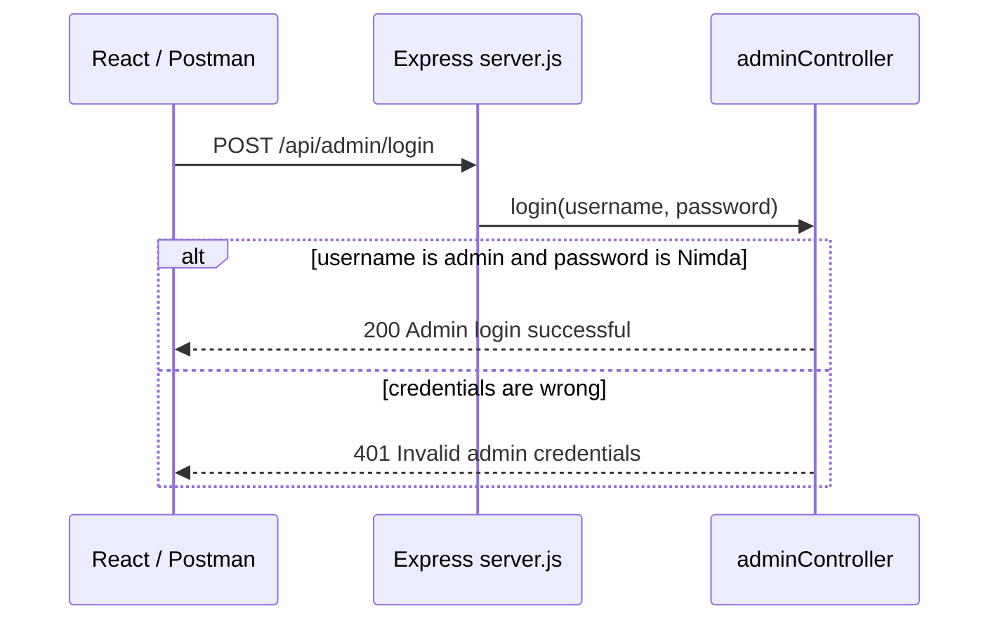
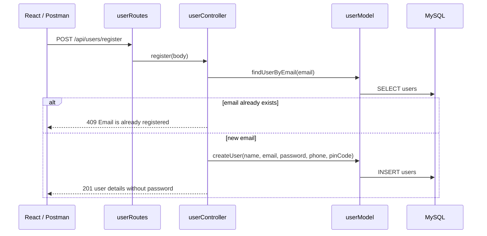
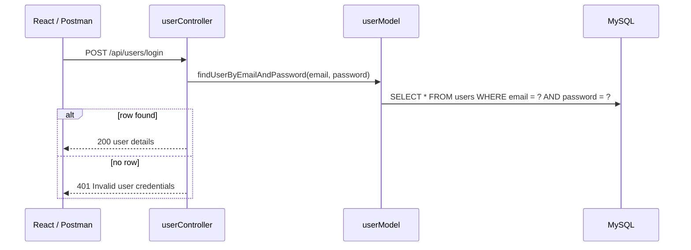
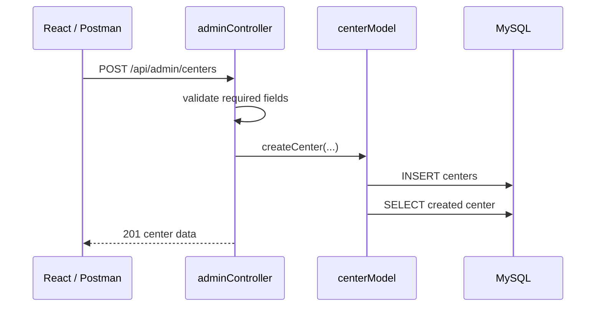
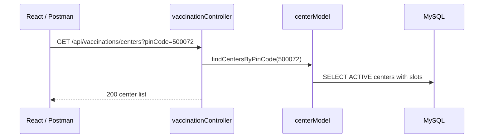
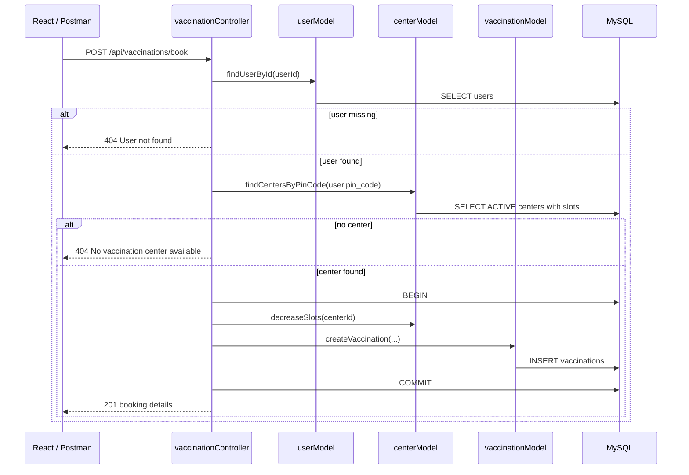
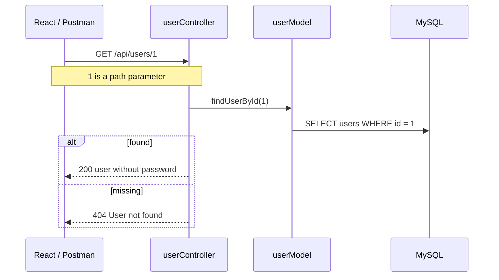
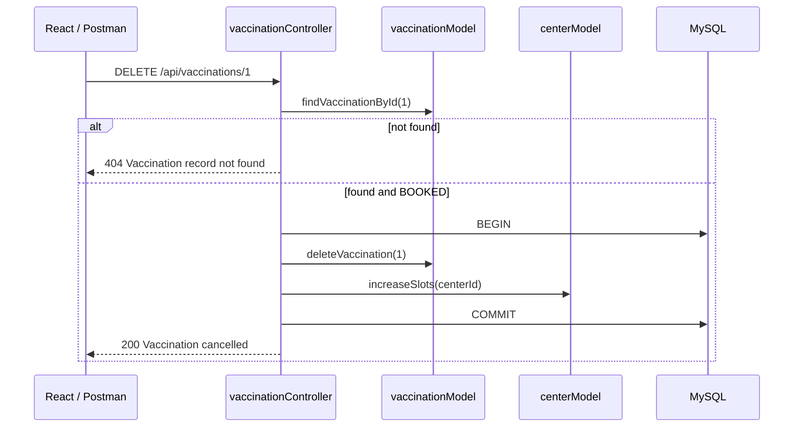

# Sequence Diagrams

These diagrams show how requests move through the system.

---

## 1. Admin Login

```text
Postman / React          Express                 adminController
      |                      |                         |
      | POST /api/admin/login|                         |
      | {admin, Nimda}       |                         |
      |--------------------->|                         |
      |                      | login(req, res)         |
      |                      |------------------------>|
      |                      |                         | compare hardcoded values
      |                      |                         |
      | 200 Admin login successful                     |
      |<---------------------|<------------------------|
```



No database call is made. No JWT is created.

---

## 2. User Registration

```text
React                    userRoutes              userController           userModel              MySQL
  |                          |                         |                      |                    |
  | POST /api/users/register |                         |                      |                    |
  |------------------------->| register()              |                      |                    |
  |                          |------------------------>| findUserByEmail()    |                    |
  |                          |                         |--------------------->| SELECT email       |
  |                          |                         |                      |------------------->|
  |                          |                         | createUser()         |                    |
  |                          |                         |--------------------->| INSERT users       |
  |                          |                         |                      |------------------->|
  | 201 User registered      |                         |                      |                    |
  |<-------------------------|<------------------------|<---------------------|<-------------------|
```



The password is stored as plain text for this training project only.

---

## 3. User Login



React can save the returned user object in state or localStorage.

---

## 4. Admin Creates a Center



---

## 5. Search Centers by Query Parameter



This is the query-parameter learning example.

---

## 6. Book Vaccination (PIN Code Allocation)

```text
React                 vaccinationController           userModel / centerModel / vaccinationModel              MySQL
  |                            |                                        |                                      |
  | POST /api/vaccinations/book|                                        |                                      |
  | {userId, date}             |                                        |                                      |
  |--------------------------->| findUserById(userId)                   |                                      |
  |                            |--------------------------------------->| SELECT users                         |
  |                            | findCentersByPinCode(user.pin_code)    |                                      |
  |                            |--------------------------------------->| SELECT centers                       |
  |                            | beginTransaction                       |                                      |
  |                            | decreaseSlots(centerId)                | UPDATE available_slots               |
  |                            | createVaccination(...)                 | INSERT vaccinations                  |
  |                            | commit                                 |                                      |
  | 201 booking + center       |                                        |                                      |
  |<---------------------------|                                        |                                      |
```



---

## 7. Get User by Path Parameter



---

## 8. Cancel Vaccination



---

## 9. End-to-End Training Story

Rahul registers with PIN Code `500072`, logs in, and books a vaccination.

```text
Rahul fills the React form
        ↓
POST /api/users/register
        ↓
User row saved in MySQL (plain-text password for training only)
        ↓
POST /api/users/login
        ↓
React stores user id = 1 in state / localStorage
        ↓
POST /api/vaccinations/book { userId: 1, vaccinationDate: "2026-09-20" }
        ↓
Backend reads PIN Code 500072
        ↓
Finds Apollo Vaccination Center (50 slots)
        ↓
Creates vaccination row and reduces slots to 49
        ↓
React shows booking success and assigned center
```
